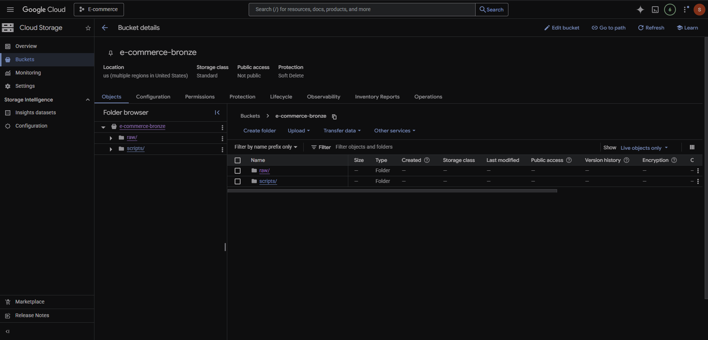
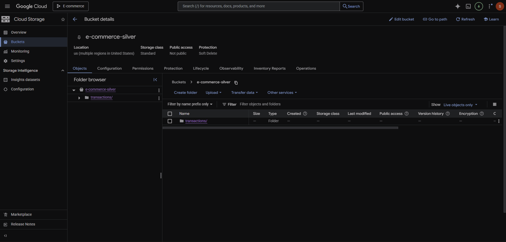
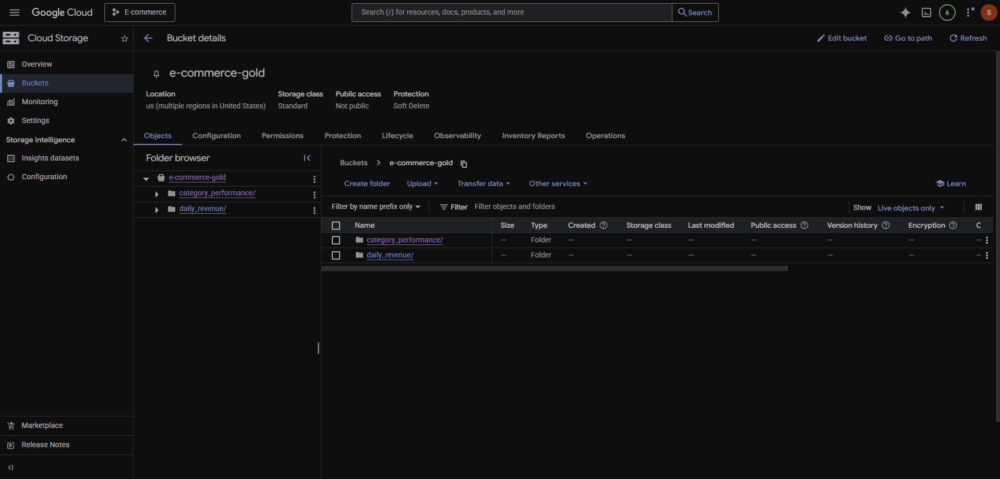
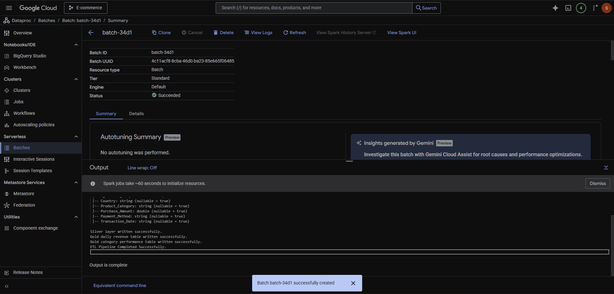
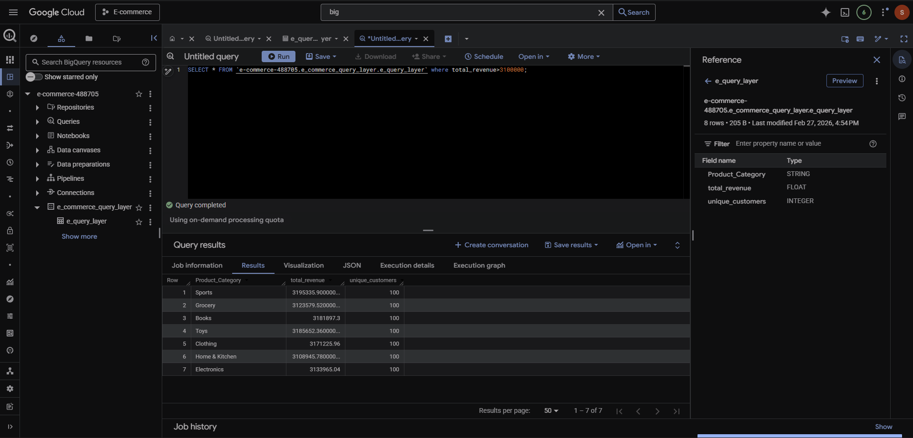

# 🚀 Cloud-Native Medallion Architecture on GCP  
### Scalable E-Commerce Analytics Lakehouse (Bronze → Silver → Gold)

---

## 📖 Project Overview

This project implements a cloud-native Medallion Architecture on Google Cloud Platform to transform raw e-commerce transaction data into scalable, analytics-ready business datasets.

The pipeline demonstrates how modern organizations build cost-efficient, high-performance data platforms capable of supporting executive dashboards, KPI reporting, and strategic decision-making.

Raw transactional data is processed using distributed Spark jobs and delivered as optimized Parquet datasets ready for BigQuery analytics.

---

## 🎯 Business Objective

Modern e-commerce platforms require:

- Scalable ingestion of raw transaction data  
- Clean and standardized analytical datasets  
- Optimized query performance  
- Cost-efficient cloud storage  
- Executive-ready KPI reporting  

This project addresses these requirements by designing a production-style lakehouse architecture.

---

## 🏗 Architecture Overview

Bronze → Silver → Gold pipeline implemented using:

- Google Cloud Storage (Data Lake)
- Google Cloud Dataproc (Distributed Spark Processing)
- Google BigQuery (Analytics Engine)

### 🔄 Data Flow

Raw CSV (Bronze - GCS)  
        ↓  
Spark ETL (Dataproc Cluster)  
        ↓  
Partitioned Parquet (Silver - GCS)  
        ↓  
Aggregated Business Tables (Gold - GCS)  
        ↓  
BigQuery External Tables & Analytics  

---

## 📂 Medallion Layers

### 🥉 Bronze Layer — Raw Ingestion

- Immutable raw CSV storage  
- Partitioned by ingestion date  
- Maintains data lineage and auditability  

📸 Bronze Structure  


---

### 🥈 Silver Layer — Cleaned & Structured Data

- Deduplication  
- Null handling  
- Date standardization  
- CSV → Partitioned Parquet conversion  
- Columnar storage optimization  

📸 Silver Partitioned Parquet Output  


---

### 🥇 Gold Layer — Business-Ready Aggregations

Generated executive-ready analytical datasets:

- Daily Revenue  
- Unique Customers  
- Category Performance Metrics  

Optimized for reporting and BI consumption.

📸 Gold Aggregated Output  


---
# ⚙️ Dataproc Batch Execution Proof

The ETL job was executed successfully using Google Cloud Dataproc.

Below is the batch job completion confirmation:



This validates:
- Distributed Spark execution  
- Successful Bronze → Silver → Gold transformation  
- Cloud-native job orchestration  
---

## 📊 BigQuery Analytics Validation

Gold datasets are connected via BigQuery external tables for zero-copy analytics.



Example validation query:

```sql
SELECT *
FROM ecommerce_analytics.daily_revenue
ORDER BY total_revenue DESC
LIMIT 10;
